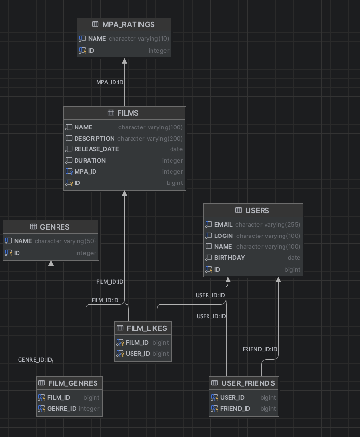

# java-filmorate



## Примеры запросов для основных операций приложения:

### Запрос списка всех пользователей

```SELECT id, email, login, name, birthday FROM users ORDER BY id```

### Запрос одного пользователя по его идентификатору

```SELECT id, email, login, name, birthday FROM users WHERE id = ?```

### Создание пользователя

```INSERT INTO users (email, login, name, birthday) VALUES (?, ?, ?, ?)```

### Получение списка фильмов

```SELECT id, name, description, release_date, duration FROM films ORDER BY id```

### Получение фильма по его идентификатору

```SELECT id, name, description, release_date, duration FROM films WHERE id = ?```

### Получение списка жанров

```SELECT * FROM genres```

### Получение списка рейтингов

```SELECT * FROM mpa_ratings ORDER BY id```